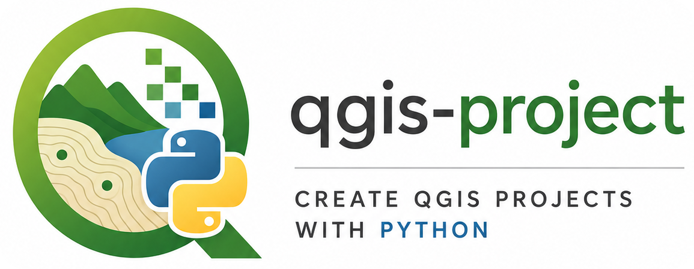

<p align="center">
  
</p>

# qgis-project

Create QGIS projects programmatically using Python — a matplotlib-style API for building `.qgz` project files.

```python
from qgis_project import Project, RasterLayer, RasterStyleBW

proj = Project()
proj.add_layer("dem.tif")
proj.add_layer("boundaries.geojson")
proj.add_layer(RasterLayer("dem.tif", style=RasterStyleBW(vmin=0, vmax=3000)))
proj.save("output.qgz")
proj.open()     # launch QGIS for visual inspection
```


## Installation

```bash
pip install qgis-project
```

QGIS is not on PyPI and must be installed separately via conda-forge:

```bash
conda install -c conda-forge qgis
pip install qgis-project
```

See the [repository README](https://github.com/ColinMoldenhauer/qgis-project#readme) for full environment setup instructions.


## Quick start

### Add layers

Pass a file path string to auto-detect the layer type (raster or vector):

```python
proj = Project()
proj.add_layer("dem.tif")           # QgsRasterLayer
proj.add_layer("roads.geojson")     # QgsVectorLayer
```

Or pass a `Layer`/`RasterLayer` object for explicit control:

```python
from qgis_project import RasterLayer

proj.add_layer(RasterLayer(file="dem.tif", name="Elevation", group="terrain"))
```

### Layer groups

```python
proj.add_layer(RasterLayer("dem.tif",   group="terrain"))
proj.add_layer(RasterLayer("slope.tif", group=["terrain", "derived"]))
```

### Raster styles

| Class | Effect |
|---|---|
| `RasterStyleBW` | Grayscale with contrast stretch |
| `RasterStyleSinglePseudocolor` | Single-band color ramp *(planned)* |
| `RasterStyleMultiPseudocolor` | Multi-band color ramp *(planned)* |

```python
from qgis_project import RasterStyleBW

layer = RasterLayer("dem.tif", style=RasterStyleBW(vmin=0, vmax=3000))
```

If `vmin`/`vmax` are omitted they are computed from the layer data.

### Inspect and open

```python
proj.print_layer_tree()     # print the layer tree to the terminal
proj.open("output.qgz")    # save and launch QGIS
proj.exit()                 # clean up without opening QGIS
```

### Project CRS

Pass `crs` to the constructor or call `set_crs()` at any point before saving.
Both EPSG integers and authority strings are accepted:

```python
proj = Project(crs="EPSG:3857")    # Web Mercator
proj = Project(crs=32632)          # UTM zone 32N (integer form)

proj.set_crs("EPSG:4326")          # change later
```

Layer CRS overrides work the same way — set `crs` on any `Layer` or `RasterLayer`
to tell QGIS the layer's CRS when the file lacks embedded metadata:

```python
proj.add_layer(Layer("scan.tif", crs=4326))
```

### Web layers

Add tile services, WMS, or WFS sources with `WebLayer`. The built-in factory methods cover the most common cases:

```python
from qgis_project import WebLayer

# OpenStreetMap XYZ tiles
proj.add_layer(WebLayer.osm())
proj.add_layer(WebLayer.osm(group="Background", visible=False))

# Any XYZ tile service
proj.add_layer(WebLayer.xyz(
    "https://tile.openstreetmap.org/{z}/{x}/{y}.png",
    name="OSM",
))

# OGC Web Map Service
proj.add_layer(WebLayer.wms(
    "https://ows.example.org/wms",
    layers="elevation",
    name="Elevation WMS",
))

# OGC Web Feature Service
proj.add_layer(WebLayer.wfs(
    "https://ows.example.org/wfs",
    typename="ns:rivers",
    name="Rivers",
))
```

### Processing

Run any QGIS Processing algorithm and add the result directly to the project. Works with both the in-process and subprocess strategies.

```python
# Buffer a vector layer — result saved to a file and added to the project
proj.process(
    "native:buffer",
    {"INPUT": "roads.geojson", "DISTANCE": 100, "OUTPUT": "roads_buffered.gpkg"},
    name="Roads (100 m buffer)",
    group="Derived",
)

# In-memory result (vector only)
proj.process(
    "native:dissolve",
    {"INPUT": "admin.geojson", "OUTPUT": "memory:"},
    name="Admin Dissolved",
)
```

Set `"OUTPUT"` to `"memory:"` for an in-memory layer (vectors only), or a file path for a persistent output. The result is automatically added to the project; no `add_layer()` call is needed.

#### Common algorithms

The table below covers frequently used operations. Pass the algorithm ID as the first argument to `process()` and match the parameter names exactly.

**Vector**

| Algorithm ID | Operation | Key parameters |
|---|---|---|
| `native:buffer` | Buffer geometries | `INPUT`, `DISTANCE`, `OUTPUT` |
| `native:dissolve` | Dissolve by field | `INPUT`, `FIELD`, `OUTPUT` |
| `native:clip` | Clip by mask layer | `INPUT`, `OVERLAY`, `OUTPUT` |
| `native:intersection` | Intersection of two layers | `INPUT`, `OVERLAY`, `OUTPUT` |
| `native:difference` | Difference (erase) | `INPUT`, `OVERLAY`, `OUTPUT` |
| `native:reprojectlayer` | Reproject to CRS | `INPUT`, `TARGET_CRS`, `OUTPUT` |
| `native:centroid` | Polygon centroids | `INPUT`, `OUTPUT` |
| `native:fixgeometries` | Repair invalid geometries | `INPUT`, `OUTPUT` |

**Raster**

| Algorithm ID | Operation | Key parameters |
|---|---|---|
| `gdal:warpreproject` | Reproject raster | `INPUT`, `TARGET_CRS`, `OUTPUT` |
| `gdal:cliprasterbymasklayer` | Clip raster by vector mask | `INPUT`, `MASK`, `OUTPUT` |
| `gdal:hillshade` | Hillshade from DEM | `INPUT`, `Z_FACTOR`, `OUTPUT` |
| `gdal:slope` | Slope from DEM | `INPUT`, `OUTPUT` |
| `gdal:aspect` | Aspect from DEM | `INPUT`, `OUTPUT` |
| `gdal:rastercalculator` | Band math | `INPUT_A`, `BAND_A`, `FORMULA`, `OUTPUT` |

To inspect all parameters for any algorithm, run `processing.algorithmHelp("native:buffer")` inside a QGIS Python console or after calling `project.process()` once to initialise the processing registry.
